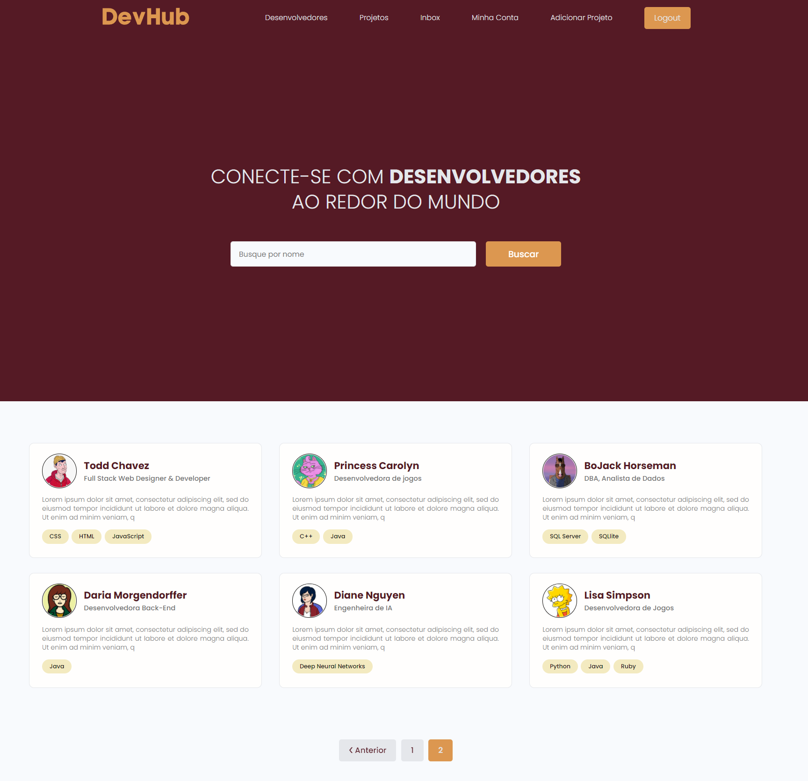

# DevHub Project

https://demo-devhub.herokuapp.com/

## Installation
* 1 - create a virtual environment and activate
*  - pip install virtualenv
*  - virtualenv envname
*  - envname\scripts\activate
* 2 - cd into project "cd devhub"
* 3 - pip install -r requirements.txt
* 4 - python manage.py runserver

## Features
* Share Projects
* Message Other Devs
* Rate Others Projects
* Search Other Devs

## Overview
* Djagno Overview
* CRUD Python
* Database Design and Models
* User Registration and Authenticaiton
* Search
* Pagination
* Building an API with Django REST Framework (DRF)
* Deployment

## Tech Stack
* Django
* Django REST Framework
* Postgres

## Home Page
  

## Projects Page
  

## Profile Page
  
